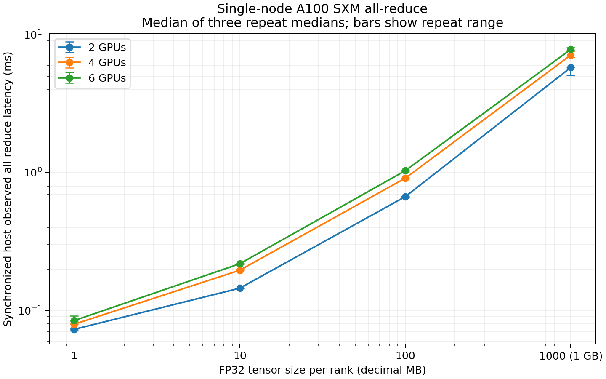

# Single-node A100 SXM FP32 all-reduce results

Completed on 2026-09-25 UTC: **36/36 launches passed**, covering 12 configurations
and three repeats on the same six-GPU allocation. Every rank passed SUM
correctness checks before warmup and after measurement. Total launch time was
279.9 seconds, excluding initial environment capture. This directory contains
the full experiment; `../a100_all_reduce_setup/` contains separate smoke tests.

## Hardware and software

| Component | Recorded setup |
| --- | --- |
| Host | `3a00ec254da0`, Linux 6.17.0-14-generic, x86_64, glibc 2.39 |
| GPUs | Six visible NVIDIA A100-SXM4-80GB devices; 81,920 MiB each in `nvidia-smi` |
| PyTorch-visible memory | 85,093,777,408 bytes per GPU |
| GPU subsets | 2 ranks: IDs 0,1; 4 ranks: 0,1,2,3; 6 ranks: 0,1,2,3,4,5 |
| Topology | Every off-diagonal GPU pair reports `NV12` in `nvidia-smi topo -m` |
| CPU / NUMA | Two AMD EPYC 7742 64-Core sockets, 128 visible CPUs, two NUMA nodes |
| GPU CPU affinity | GPUs 0–1: CPUs 0–63 / NUMA 0; GPUs 2–5: CPUs 64–127 / NUMA 1 |
| Host RAM | Approximately 2.0 TiB; no swap (captured after the run) |
| Driver | 580.126.16 |
| Python | 3.12.3 |
| PyTorch / CUDA | 2.11.0+cu130 / 13.0 |
| NCCL | 2.28.9, as reported by `torch.cuda.nccl.version()` |
| Workers | One process per GPU; `OMP_NUM_THREADS=1`; no explicit CPU affinity pinning |

[environment.json](environment.json) preserves the original topology, GPU UUIDs,
PCI bus IDs, GPU status, versions, launch settings, and source hashes.
[hardware_supplement.json](hardware_supplement.json) records CPU and memory details
collected after the experiment. NV12 is the observed connectivity label;
provider confirmation of the physical NVSwitch arrangement was not obtained.
The inherited environment contains `NCCL_VERSION=2.25.1-1`; this label differs
from the NCCL version reported by the installed PyTorch runtime above.

The initial GPU snapshot showed 0% utilization and no listed running processes.
No competing workload was intentionally launched, but continuous system-wide
workload monitoring was not collected. GPU clocks, CPU affinity, and NCCL
algorithm/protocol were not explicitly fixed or recorded throughout execution.

## Measurement and reproducibility

Each launch initializes one NCCL process group and binds the local CUDA rank
before collectives. Tensors are contiguous FP32, with sizes in decimal bytes:
1 MB = 1,000,000 bytes; 1 GB = 1,000,000,000 bytes. Each rank fills its input
with `rank + 1`; the expected SUM is `world_size * (world_size + 1) / 2`.
Inputs are reset outside timing on every iteration to prevent accumulated sums.

Each configuration uses 5 warmups and 50 measured iterations. After input
preparation, a barrier and local CUDA synchronization align ranks. A monotonic
host timer encloses blocking `all_reduce(SUM)` and a final CUDA synchronization.
Preparation, barriers, validation, and post-measurement object gathering are
excluded. These are **synchronized host-observed call latencies**, including
host/runtime overhead, rather than pure GPU kernel durations.

For each iteration, take the maximum latency across ranks, then compute the
median and inclusive-interpolated IQR across 50 iterations. JSON files preserve
all rank samples, rank medians, iteration maxima, and quartiles. The table lists
each repeat separately; its final column is the median of three repeat medians.
Plot error bars show the minimum and maximum repeat medians, not a confidence
interval or within-repeat IQR. Repeats ran sequentially, with rank counts 2,4,6
and ascending sizes within each repeat; ordering was not randomized.

The runner was an uncommitted addition based on repository commit
`81bb42759bb2dd9cc7782f943759204d05e0a9ca` at execution. Its exact source and
`uv.lock` are archived here, with SHA-256 hashes in `environment.json`.
Each `.launch.json` records the actual command, GPU subset, exit status, and
wall time. All launches finished well below their 290-second limit.
Worker logs contain PyTorch device-inference warnings for barriers; the runner
sets the CUDA device to local rank before initialization, uses contiguous local
rank mappings on one node, and every launch completed and validated successfully.

From the repository root:

```sh
bash scripts/setup_all_reduce.sh
# Use a fresh directory: the runner deliberately refuses existing output paths.
.venv/bin/python scripts/benchmark_all_reduce.py \
  --gpu-ids 0,1,2,3,4,5 --output benchmark_results/a100_sxm_all_reduce_rerun
# Regenerate the committed comparison artifacts without using GPUs:
.venv/bin/python scripts/report_all_reduce.py benchmark_results/a100_sxm_all_reduce
```

## Results



All latency values are in milliseconds. Each repeat summarizes 50 iteration-wise rank maxima.

| Size per rank | GPUs | Repeat 1 median / IQR | Repeat 2 median / IQR | Repeat 3 median / IQR | Median of medians |
| --- | ---: | ---: | ---: | ---: | ---: |
| 1 MB | 2 | 0.0722 / 0.0022 | 0.0745 / 0.0064 | 0.0729 / 0.0081 | 0.0729 |
| 1 MB | 4 | 0.0793 / 0.0088 | 0.0798 / 0.0093 | 0.0794 / 0.0089 | 0.0794 |
| 1 MB | 6 | 0.0844 / 0.0101 | 0.0913 / 0.0104 | 0.0839 / 0.0088 | 0.0844 |
| 10 MB | 2 | 0.1450 / 0.0043 | 0.1457 / 0.0114 | 0.1450 / 0.0062 | 0.1450 |
| 10 MB | 4 | 0.1951 / 0.0112 | 0.1957 / 0.0109 | 0.1997 / 0.0113 | 0.1957 |
| 10 MB | 6 | 0.2181 / 0.0075 | 0.2181 / 0.0116 | 0.2168 / 0.0079 | 0.2181 |
| 100 MB | 2 | 0.6689 / 0.0040 | 0.6690 / 0.0042 | 0.6687 / 0.0057 | 0.6689 |
| 100 MB | 4 | 0.9102 / 0.0071 | 0.9125 / 0.0079 | 0.9105 / 0.0077 | 0.9105 |
| 100 MB | 6 | 1.0318 / 0.0074 | 1.0308 / 0.0069 | 1.0326 / 0.0091 | 1.0318 |
| 1 GB | 2 | 5.7923 / 0.0559 | 5.0619 / 0.0659 | 5.7962 / 0.1069 | 5.7923 |
| 1 GB | 4 | 6.8754 / 0.8409 | 7.1204 / 0.3971 | 7.6343 / 0.8494 | 7.1204 |
| 1 GB | 6 | 7.6829 / 0.4495 | 8.0904 / 0.7199 | 7.8366 / 0.6935 | 7.8366 |

Latency rises with tensor size: the median of repeat medians increases from
0.0729 to 5.7923 ms for 2 GPUs, 0.0794 to 7.1204 ms for 4 GPUs, and 0.0844 to
7.8366 ms for 6 GPUs between 1 MB and 1 GB. Despite all-pairs NV12 connectivity,
more ranks increase latency at every tested size; at 1 GB, 6 GPUs take about
35% longer than 2 GPUs, consistent with additional communication/coordination
cost, though these measurements do not isolate its cause. Repeat variation is
most evident at 1 GB (median ranges: 5.0619–5.7962, 6.8754–7.6343, and
7.6829–8.0904 ms for 2/4/6 GPUs), so topology alone does not explain the observed
latency and three repeats do not establish the source of this variation.

## Artifact index and validation

- [summary.csv](summary.csv): all 36 per-launch results, including within-repeat IQR.
- [comparison.csv](comparison.csv), [comparison.md](comparison.md): 12-configuration summaries.
- [latency.svg](latency.svg), [latency.png](latency.png): vector and raster figures.
- `repeat*_ranks*_bytes*.json`: raw samples and statistics; corresponding
  `.launch.json` and `.log` files preserve launch settings and worker output.
- [Background launch record](../a100_all_reduce_launch/launch.json) and
  [full progress log](../a100_all_reduce_launch/run.log).

Validation included CPU/Gloo smoke checks, NCCL smoke checks on all three GPU
counts, aggregation unit tests, timeout handling, lint and shell syntax checks.
All 36 full-run JSON files contain exactly 50 samples per rank and successful
correctness flags. Rental billing, provider identity, and termination are not
recorded by this benchmark; the completion of the benchmark does not terminate
the host allocation.
